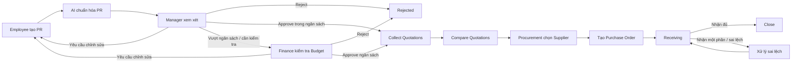

# ProcureAI Workflow

## 1. Workflow tổng quan

## 2. Các bước nghiệp vụ

| Bước | Trạng thái | Vai trò chính | Mô tả |
|---|---|---|---|
| 1 | `Draft` / `Submitted` | Employee | Tạo PR, nhập thông tin bắt buộc và Submit. |
| 2 | `AI Review` | Employee | Review và chỉnh sửa gợi ý Category, thông số kỹ thuật hoặc nội dung do AI chuẩn hóa. |
| 3 | `Manager Review` | Manager | Xem PR, Budget khả dụng và quyết định Approve, Reject, yêu cầu chỉnh sửa hoặc chuyển Finance. |
| 4 | `Finance Review` | Finance | Kiểm tra Budget đối với PR được chuyển sang Finance hoặc PR thuộc policy bắt buộc kiểm tra ngân sách. |
| 5 | `Quotation Collection` | Procurement | Thu thập và liên kết nhiều Quotation với PR đã được phê duyệt. |
| 6 | `Quotation Comparison` | Procurement | Review dữ liệu AI extraction, chỉnh sửa nếu cần và so sánh các Supplier. |
| 7 | `Supplier Selected` | Procurement | Chọn Supplier dựa trên ma trận so sánh và Recommendation hỗ trợ từ AI. |
| 8 | `PO Created` | Procurement | Tạo PO từ PR và Quotation đã được phê duyệt. |
| 9 | `Receiving` | Người dùng có quyền | Ghi nhận nhận đủ, nhận một phần hoặc sai lệch so với PO. |
| 10 | `Close` | Finance / người có quyền | Hoàn tất đối soát `PR ↔ PO ↔ Receiving` và đóng PR. |

## 3. Quy tắc chuyển trạng thái

| Trạng thái hiện tại | Hành động | Trạng thái tiếp theo | Điều kiện |
|---|---|---|---|
| `Draft` | Submit | `Submitted` | Đủ trường bắt buộc. |
| `Submitted` | AI Standardizer | `AI Review` | AI chỉ đưa ra gợi ý. |
| `AI Review` | Xác nhận dữ liệu | `Manager Review` | Người dùng đã review và xác nhận dữ liệu AI. |
| `Manager Review` | Approve | `Quotation Collection` | PR nằm trong phạm vi ngân sách hoặc không cần Finance review. |
| `Manager Review` | Chuyển Finance | `Finance Review` | Cần kiểm tra hoặc phê duyệt ngân sách. |
| `Manager Review` | Reject | `Rejected` | Bắt buộc ghi nhận lý do. |
| `Finance Review` | Approve | `Quotation Collection` | Finance chấp thuận theo policy. |
| `Finance Review` | Reject | `Rejected` | Bắt buộc ghi nhận lý do. |
| `Quotation Collection` | Hoàn tất thu thập | `Quotation Comparison` | Quotation được liên kết với PR. |
| `Quotation Comparison` | Chọn Supplier | `Supplier Selected` | Procurement đã review dữ liệu và quyết định thủ công. |
| `Supplier Selected` | Tạo PO | `PO Created` | PR đã được phê duyệt. |
| `PO Created` | Ghi nhận giao hàng | `Receiving` | PO hợp lệ. |
| `Receiving` | Nhận đủ và khớp | `Close` | Đối soát PR, PO và Receiving hoàn tất. |
| `Receiving` | Nhận một phần / sai lệch | `Receiving Exception` | Ghi nhận chi tiết sai lệch và xử lý tiếp. |

## 4. Quy tắc kiểm soát

- AI không được tự Approve, Reject, chọn Supplier hoặc tự chặn workflow.
- Người dùng phải review và xác nhận mọi dữ liệu AI extraction trước khi sử dụng.
- Người tạo PR không được tự phê duyệt PR của chính mình.
- PR vượt Budget phải được cảnh báo.
- Tổng số lượng Receiving không được vượt số lượng trên PO.
- Không được Close PR nếu chưa hoàn tất Receiving và đối soát `PR ↔ PO ↔ Receiving`.
- Invoice và đối soát kế toán chi tiết nằm ngoài phạm vi MVP.
- Mọi hành động Approve, Reject, chuyển Finance, chỉnh sửa dữ liệu AI và thay đổi trạng thái phải được ghi vào Audit Trail.

## 5. Các trạng thái kết thúc

| Trạng thái | Ý nghĩa |
|---|---|
| `Close` | PR hoàn tất quy trình và đối soát thành công. |
| `Rejected` | PR bị từ chối bởi Manager hoặc Finance. |
| `Receiving Exception` | Receiving có sai lệch và cần xử lý trước khi Close. |
