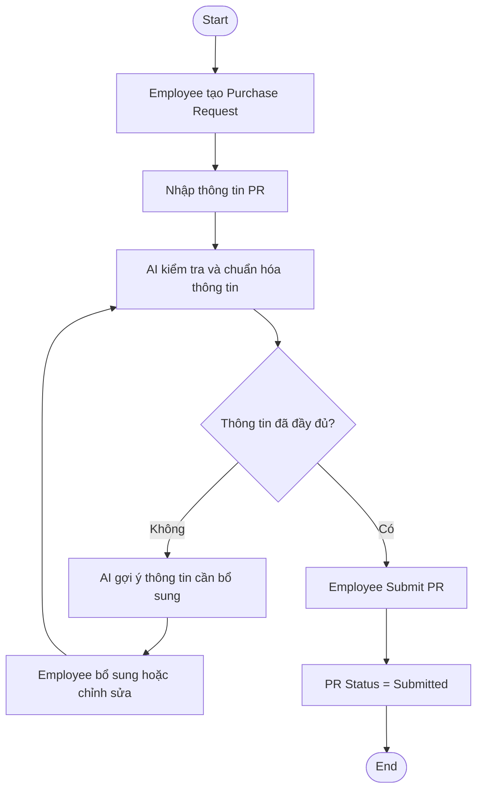
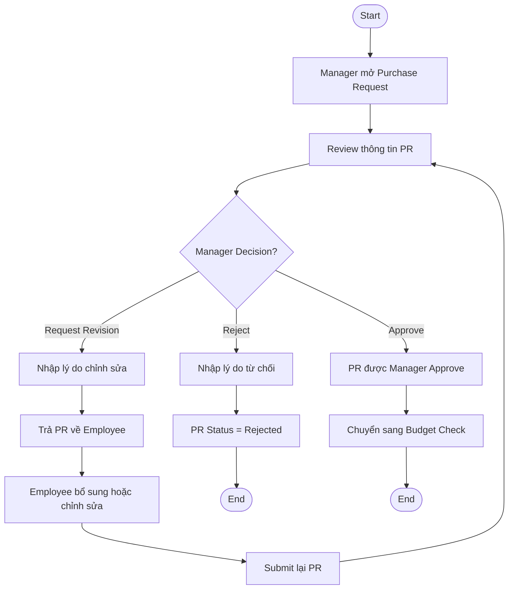
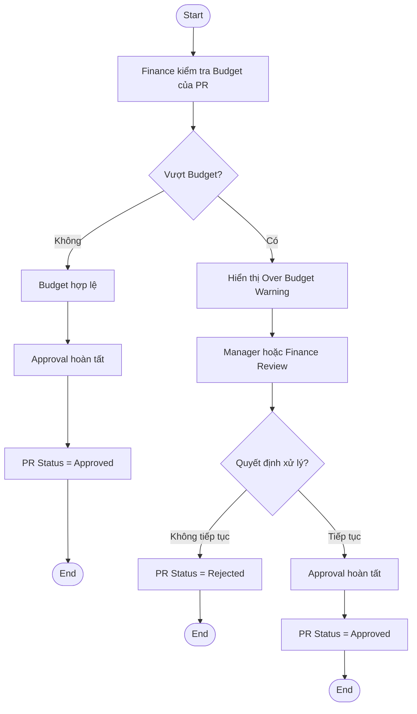
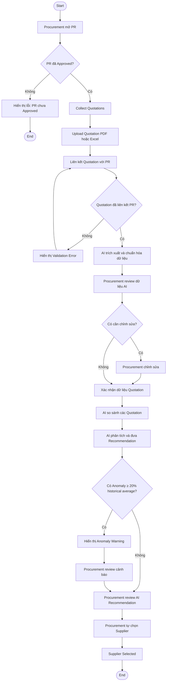
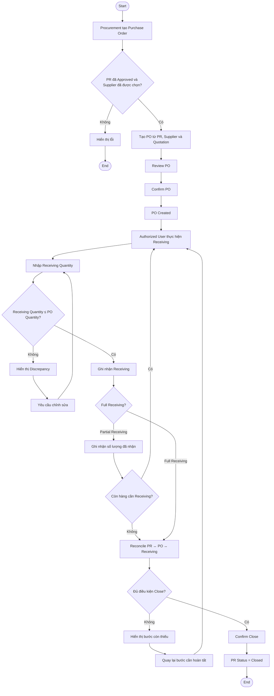

# ProcureAI — Mermaid Flowcharts

## F01 — Tạo PR + AI

**Mục tiêu:** Giúp Employee tạo PR đầy đủ thông tin, review gợi ý AI và tự Submit PR hợp lệ. AI chỉ kiểm tra/chuẩn hóa/gợi ý; không tự Submit.

| Màn hình | Người dùng | Nội dung và thao tác chi tiết | Kết quả / điều kiện |
|---|---|---|---|
| F01-S01 — Tạo PR | Employee | Nhập mục đích mua sắm, Department/Cost Center, Category, Budget Code, sản phẩm/dịch vụ, số lượng, thông số kỹ thuật và dự toán chi phí. Có lưu Draft và chuyển sang AI kiểm tra. | PR ở Draft; các trường bắt buộc chi tiết theo Category cần được xác nhận (Q-02). |
| F01-S02 — AI review PR | Employee | Hiển thị mô tả chuẩn hóa, Category/thông số được gợi ý và các thông tin thiếu. Employee có thể chấp nhận, chỉnh sửa hoặc bỏ qua từng gợi ý. | Chỉ Employee xác nhận dữ liệu trước Submit; lưu dấu vết kết quả review AI. |
| F01-S03 — Submit validation | Employee | Khi nhấn Submit, hiển thị lỗi ngay tại trường thiếu và tóm tắt lỗi; cho phép quay lại form để sửa. | Chỉ khi dữ liệu đầy đủ mới đổi `PR Status = Submitted` và chuyển Manager review. |

## F02 — Manager Approval

**Mục tiêu:** Cho Manager có quyền review PR thuộc phạm vi của mình và đưa ra Approve, Reject hoặc Request Revision; không cho phép self-approval.

| Màn hình | Người dùng | Nội dung và thao tác chi tiết | Kết quả / điều kiện |
|---|---|---|---|
| F02-S01 — Approval inbox | Manager | Liệt kê PR đang chờ review thuộc phạm vi xử lý; hiển thị mã PR, người tạo, trạng thái và giá trị dự toán. | Chỉ Manager có quyền mới mở/xử lý PR tương ứng. |
| F02-S02 — Manager PR review | Manager | Xem toàn bộ dữ liệu PR đã chuẩn hóa, thông tin Budget hiển thị được, tệp/liên kết liên quan và Audit Trail; chọn Approve, Reject, Request Revision hoặc chuyển Budget Check. | Quyết định Approval do Manager thực hiện; không cho người tạo PR tự approve PR của mình. |
| F02-S03 — Decision reason | Manager | Nhập lý do khi Reject hoặc Request Revision, xác nhận hành động. | Reject đổi PR sang `Rejected`; Revision trả PR về Employee để sửa và Submit lại; mọi quyết định được ghi Audit Trail. |

## F03 — Budget Check

**Mục tiêu:** Giúp Finance kiểm tra PR với Budget, hiển thị cảnh báo Over Budget và để người có quyền quyết định tiếp tục hay từ chối theo policy.

| Màn hình | Người dùng | Nội dung và thao tác chi tiết | Kết quả / điều kiện |
|---|---|---|---|
| F03-S01 — Finance inbox | Finance | Liệt kê PR được chuyển sang Finance hoặc thuộc policy cần Budget review. | Chỉ Finance có quyền xử lý Budget review. |
| F03-S02 — Budget review | Finance | Hiển thị giá trị PR, Budget khả dụng, dữ liệu PR và kết quả đối chiếu; thực hiện Approve hoặc Reject theo policy. | Không tự đặt ngưỡng Budget; policy/threshold cụ thể cần được xác nhận (Q-03). |
| F03-S03 — Over Budget warning | Finance; Manager theo quyền | Hiển thị cảnh báo vượt Budget cùng dữ liệu đối chiếu để người có quyền review và quyết định xử lý. | Cảnh báo không tự động Reject. Nếu tiếp tục, PR thành `Approved`; nếu không, PR thành `Rejected`. |

## F04 — Quotation + AI so sánh + chọn Supplier

**Mục tiêu:** Procurement thu thập quotation cho PR đã Approved, review dữ liệu AI, so sánh các phương án và tự chọn Supplier. AI chỉ hỗ trợ phân tích, recommendation và cảnh báo.

| Màn hình | Người dùng | Nội dung và thao tác chi tiết | Kết quả / điều kiện |
|---|---|---|---|
| F04-S01 — Quotation collection | Procurement | Chọn PR, Supplier và upload Quotation PDF/Excel; theo dõi danh sách quotation đã thu thập. | Chỉ cho thao tác khi PR đã `Approved`; mỗi quotation phải liên kết PR. |
| F04-S02 — Extraction review | Procurement | Mở file gốc và dữ liệu AI trích xuất/chuẩn hóa: hàng hóa/dịch vụ, số lượng, đơn giá, thuế, phí vận chuyển, tổng tiền, giao hàng, bảo hành. Có thể sửa và xác nhận. | Dữ liệu AI phải được Procurement review trước khi dùng so sánh. |
| F04-S03 — Comparison matrix | Procurement | Đối chiếu quotation từ nhiều Supplier theo các tiêu chí, mở file gốc và dữ liệu đã xác nhận. | Nếu quotation chưa liên kết PR, hiển thị validation error và quay về liên kết. |
| F04-S04 — AI analysis & anomaly | Procurement | Hiển thị AI analysis, recommendation, lý do/dữ liệu đối chiếu và Anomaly Warning khi đơn giá `≥ 20%` mức trung bình lịch sử nếu có dữ liệu. | Thiếu dữ liệu lịch sử/tiêu chí thì báo thiếu dữ liệu; AI không tự loại hoặc chọn Supplier. |
| F04-S05 — Supplier selection | Procurement | Review recommendation/cảnh báo rồi tự chọn Supplier và quotation được chọn. | Lưu `Supplier Selected` và Audit Trail; quyết định cuối cùng thuộc Procurement. |

## F05 — Purchase Order + Receiving + Reconcile + Close

**Mục tiêu:** Tạo PO từ PR/Supplier/Quotation hợp lệ, ghi nhận Receiving đầy đủ hoặc từng phần, đối soát và chỉ Close PR khi các bước liên quan hoàn tất.

| Màn hình | Người dùng | Nội dung và thao tác chi tiết | Kết quả / điều kiện |
|---|---|---|---|
| F05-S01 — PO creation & review | Procurement | Hiển thị PR đã Approved, Supplier và Quotation đã chọn; tạo PO, review nội dung và Confirm PO. | Chặn tạo PO nếu PR chưa Approved hoặc chưa chọn Supplier. PO liên kết PR/Supplier/Quotation đã chọn. |
| F05-S02 — Receiving form | Authorized User | Hiển thị PO và số lượng còn lại; nhập Receiving Quantity, chọn/ghi nhận kết quả Receiving. | Tổng Receiving Quantity không được vượt PO Quantity; khi vượt thì hiển thị Discrepancy và yêu cầu nhập lại. |
| F05-S03 — Partial Receiving | Authorized User | Hiển thị tổng đã nhận/còn thiếu, lưu số lượng nhận từng đợt và cho phép tiếp tục Receiving khi còn hàng thiếu. | Chưa được Close khi vẫn còn Receiving cần hoàn tất hoặc exception. |
| F05-S04 — Reconcile & Close | Authorized User; Finance theo quyền | Đối soát `PR ↔ PO ↔ Receiving`, hiển thị các hạng mục chưa hoàn tất và yêu cầu Confirm Close. | Chỉ khi điều kiện Close đạt mới đổi `PR Status = Closed`; không bao gồm Payment/Accounting. |

## Role flows

| Role | Primary flow |
|---|---|
| Employee | Tạo PR → Review AI → Submit → Theo dõi trạng thái → Phối hợp Receiving |
| Manager | Xem PR → Budget visibility → Approve / Reject / Revision / Chuyển Finance |
| Finance | Kiểm tra Budget → Approve hoặc Reject theo policy |
| Procurement | Thu thập Quotation → Review extraction → Compare → Chọn Supplier → Tạo PO |
| Admin | Quản lý RBAC, danh mục, Budget và Audit Trail |

## Flow constraints

- Không Collect Quotations trước khi PR được Approve.
- Không tạo PO trước khi PR được Approve và Supplier được chọn.
- Không Close trước khi Receiving và đối soát `PR ↔ PO ↔ Receiving` hoàn tất.
- AI không thay thế quyết định của người có thẩm quyền.
