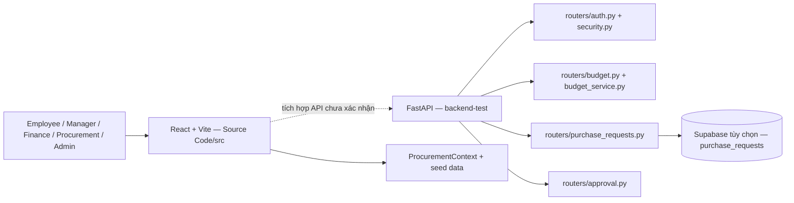

# ProcureAI — Kiến trúc và ADR

## Trạng thái

Tài liệu mô tả cấu trúc source hiện tại. Frontend React/Vite và backend FastAPI nằm trong hai thư mục riêng; chưa thấy bằng chứng frontend đang gọi backend. Các tính năng trên prototype không được xem là API đã triển khai.

## Bối cảnh và sơ đồ

## Module và trách nhiệm

| Module | Vị trí | Trách nhiệm hiện có |
|---|---|---|
| Frontend | `Source Code/src/` | React/TypeScript pages, routing, role guard, state mua sắm và dữ liệu mẫu |
| API khởi tạo | `backend-test/main.py` | Tạo FastAPI app, gắn routers auth, budget, purchase request, approval |
| Xác thực | `routers/auth.py`, `security.py`, `data_store.py` | Login, JWT, thông tin user/permission demo, kiểm tra role |
| Budget | `routers/budget.py`, `services/budget_service.py` | Danh sách ngân sách và budget check; dữ liệu hiện cấu hình trong bộ nhớ |
| Purchase Request | `routers/purchase_requests.py`, `models.py` | Liệt kê/tạo PR, validation schema, tùy chọn ghi Supabase |
| Approval | `routers/approval.py` | Manager approve/reject/yêu cầu chỉnh sửa PR đang chờ |
| Persistence | `database.py`, `supabase/migrations/001_create_purchase_requests.sql` | Supabase tùy chọn; migration hiện tạo một bảng PR |

## Luồng hiện tại

1. User gửi form tới `/auth/login`; backend trả JWT và profile demo.
2. Route được bảo vệ xác thực JWT và role.
3. Employee/Admin tạo PR; API validate title, department, amount, category, justification, requester; tính snapshot ngân sách và đặt trạng thái `PENDING_APPROVAL`.
4. User đã đăng nhập có thể đọc danh sách PR.
5. Manager quyết định approve/reject/revision một lần cho PR `PENDING_APPROVAL`.

## Ranh giới và hạn chế

- Chưa thấy frontend API client hoặc cấu hình tích hợp với FastAPI.
- Supabase có thể bật/tắt; nếu tắt, request lưu trong memory của tiến trình.
- Finance approval tiếp sau Manager, Supplier/Quotation, AI, PO, Receiving và Close chưa có route/schema backend tương ứng.
- Role bảo vệ route ở backend, nhưng dữ liệu user/budget demo nằm trong bộ nhớ.
- CORS, production deployment, secret management và chính sách backup chưa được xác định trong các file đã rà soát.

## ADR

### ADR-001 — Ghi nhận frontend/backend là hai ứng dụng chưa xác nhận tích hợp

- **Trạng thái:** Quyết định mô tả tài liệu.
- **Bối cảnh:** Có source React/Vite và FastAPI riêng; chưa thấy API client ở frontend.
- **Quyết định:** Tài liệu hóa hai container riêng, ghi quan hệ kết nối là chưa xác nhận.
- **Hệ quả:** UI prototype không được coi là bằng chứng backend workflow đã hoàn chỉnh.

### ADR-002 — Supabase là persistence tùy chọn của backend hiện tại

- **Trạng thái:** Đã có trong code, chưa phải quyết định production.
- **Bối cảnh:** Backend dùng config `USE_SUPABASE`; migration tạo `purchase_requests`.
- **Quyết định:** Mô tả đúng cơ chế tùy chọn hiện có.
- **Hệ quả:** Cần thiết kế schema bổ sung và vận hành trước khi hỗ trợ toàn workflow.

### ADR-003 — AI hỗ trợ, người có quyền ra quyết định

- **Trạng thái:** Business rule từ `CON-03`, `REQ-BR-08`.
- **Quyết định:** AI không tự approve/reject hoặc chọn Supplier.
- **Hệ quả:** Kết quả AI tương lai phải có thể xem xét và không tự thực hiện quyết định nghiệp vụ.
