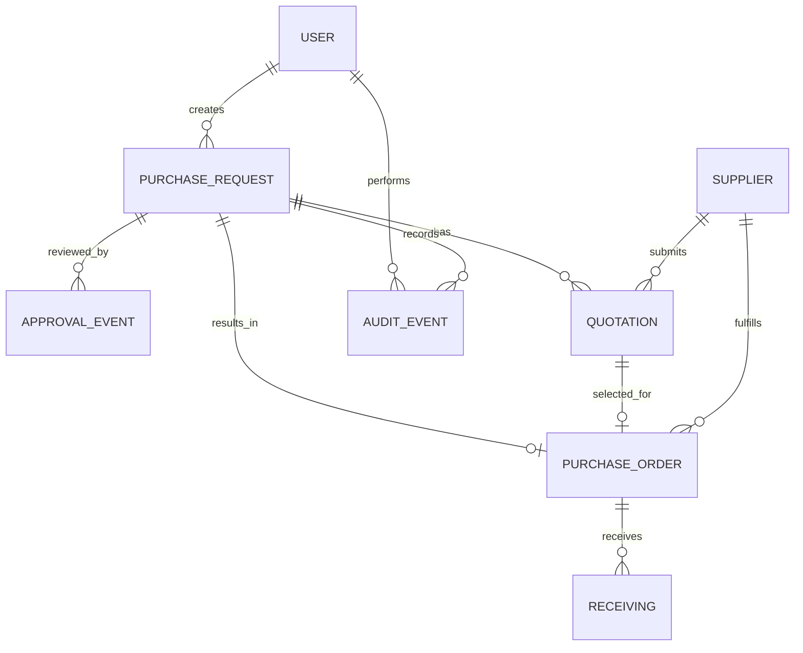

# ProcureAI — ERD và mô hình dữ liệu

## Phạm vi triển khai hiện tại

Migration `backend-test/supabase/migrations/001_create_purchase_requests.sql` hiện chỉ tạo bảng `purchase_requests`. Các entity trong sơ đồ domain là mô hình cần thiết kế theo workflow; không khẳng định đã có trong database.

## Bảng `purchase_requests` hiện có

| Cột | Kiểu/ràng buộc | Ý nghĩa |
|---|---|---|
| `id` | `text`, primary key | Mã PR |
| `title` | `varchar(120) NOT NULL` | Tiêu đề |
| `department` | `text NOT NULL` | Phòng ban |
| `amount` | `numeric(15,2) NOT NULL`, `> 0` | Giá trị dự kiến |
| `category` | `text NOT NULL` | Danh mục |
| `justification` | `text NOT NULL` | Lý do mua |
| `requester` | `text NOT NULL`, default | Người yêu cầu |
| `created_by`, `created_role` | `text NOT NULL` | Người tạo và role |
| `status` | `text`, check constraint | `PENDING_APPROVAL`, `APPROVED`, `REJECTED`, `REVISION_REQUIRED` |
| `created_at` | `timestamptz`, default `now()` | Thời điểm tạo |
| `approved_by`, `approved_at`, `approval_comment` | nullable | Dữ liệu approve |
| `rejected_by`, `rejected_at` | nullable | Dữ liệu reject |
| `revision_requested_by`, `revision_requested_at`, `revision_comment` | nullable | Dữ liệu yêu cầu sửa |
| `next_approval_role` | nullable `text` | Role tiếp theo |
| `budget_limit`, `budget_spent`, `budget_available`, `budget_remaining` | nullable `numeric(15,2)` | Snapshot Budget |
| `is_within_budget` | nullable `boolean` | Kết quả budget check |

Index hiện có trên `status`, `created_by`, `created_at`. Migration chưa có `updated_at`, foreign key hoặc audit-event table.

## Sơ đồ domain mục tiêu

## Entity cần bổ sung/thiết kế

| Entity | Khóa/quan hệ dự kiến | Ràng buộc cần xác nhận |
|---|---|---|
| User | `user_id`; tham chiếu PR/approval/audit | Nguồn identity, role assignment và trạng thái user |
| Budget | `budget_id` hoặc khóa phòng ban+kỳ | Kỳ ngân sách, tiền tệ, hạn mức và số đã cam kết |
| Approval Event | `approval_event_id`; FK PR và User | Lưu từng quyết định, actor, thời điểm, lý do, vòng duyệt |
| Supplier | `supplier_id` | Trường liên hệ, trạng thái và thuộc tính đánh giá |
| Quotation | `quotation_id`; FK PR/Supplier | File, tiền tệ, line items, thuế/phí, hiệu lực và trạng thái review |
| Purchase Order | `po_id`; FK PR/Supplier/Quotation | Số PO, điều khoản, trạng thái và thời điểm phát hành |
| Receiving | `receiving_id`; FK PO/User | Số lượng từng lần, người nhận, sai lệch và thời điểm |
| Audit Event | `audit_event_id`; actor/đối tượng | Hành động, thời gian, dữ liệu trước/sau phù hợp `REQ-NFR-03` |

Trước khi chốt schema cần xác nhận tiền tệ, timezone, kỳ Budget, versioning khi sửa PR, partial receiving và chính sách lưu file quotation.
